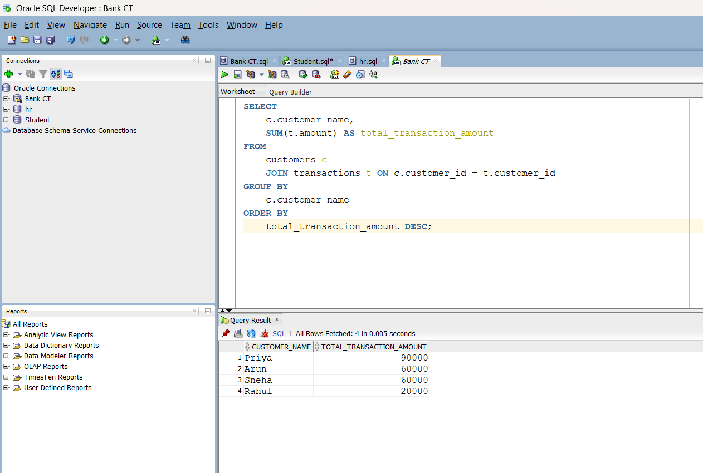

# Bank Customer Transaction Analysis SQL Project
## Overview
This project analyzes bank customer transaction to identify spending patterns, detect fraud, and segment customers.

##Tools Used
-Oracle SQL Developer
-SQL

## key Features
-Joins & Aggregations
-Monthly Transaction Analysis
-Fraud detection using threshold logic
-Customer Segmentations using CASE WHEN

## Project Files
-01_create_tables.sql
-02_insert_data.sql
-03_analysis_queries.sql

## Sample Output
###Total Transaction per Customer

###Customer Segmentation

